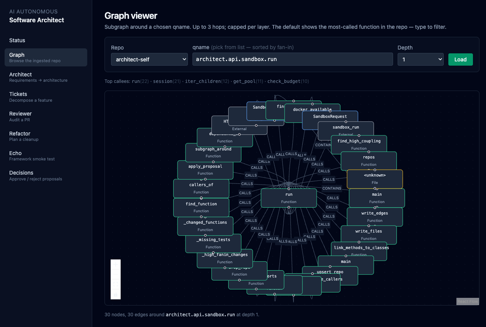
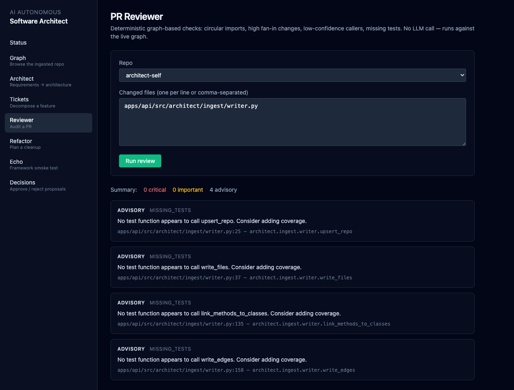

# AI Autonomous Software Architect

A knowledge-graph-backed AI system that behaves like a senior tech lead. Ingest a codebase; the graph models its services, modules, functions, calls, and imports. Then run five agents over it:

| Agent | What it does | Needs LLM? |
|---|---|---|
| **Architect** | Requirements → architecture (services + tables + APIs + NFRs) + a staged graph delta you can approve | Yes |
| **Tickets** | Feature description → ordered ticket list (FE / API / DB / tests / observability / rollout) | Yes |
| **Reviewer** | PR-style audit against the graph: circular imports, high-fanin changes, low-confidence callers, missing tests | No |
| **Refactor** | Plan: dead code, high-coupling modules, ordered by blast radius | No |
| **Echo** | Framework smoke-test agent | Yes |

Reviewer and Refactor produce useful output without any LLM — they're pure graph analytics over the ingested repo.

## Stack

| Layer | Choice |
|---|---|
| Graph DB | Neo4j 5 + APOC |
| Vector store | Postgres 16 + pgvector |
| Code parsing | Tree-sitter (Python + TypeScript) via `tree-sitter-language-pack` |
| Embeddings | OpenAI `text-embedding-3-large` |
| Agent runtime | LangGraph 1.x with Postgres checkpointer |
| API | FastAPI + uv |
| UI | Vite + React + TS + Tailwind + `@xyflow/react` |
| Sandbox | Docker (rootless, `--network=none`, `--cap-drop=ALL`, time + mem limits) |

## Quick setup

**Requirements:** Docker + `uv` + `pnpm` + Node 20+. macOS or Linux.

```bash
# 1. Clone + install everything
git clone https://github.com/nicolqs/software-architect-knowledge-graph.git
cd software-architect-knowledge-graph
make install              # root pnpm + apps/api (uv) + apps/web (pnpm)

# 2. Configure
cp .env.example .env      # already-sane defaults + placeholder passwords
# Optional: edit .env to switch providers
#   AGENT_PROVIDER=openai           # or "anthropic"
# Keep API keys in your shell, not in .env:
#   export OPENAI_API_KEY=sk-...
#   export ANTHROPIC_API_KEY=sk-ant-...

# 3. Bring up infra (Neo4j + Postgres + Langfuse via Docker)
make up

# 4. Ingest a repo. This repo into itself is the easiest demo:
make ingest REPO=$(pwd)
# Or any other repo:
make ingest REPO=/path/to/your-project

# 5. Start API + UI in parallel
make dev
# → API: http://localhost:8000   UI: http://localhost:5173
```

Port collisions? Override `NEO4J_HTTP_PORT`, `NEO4J_BOLT_PORT`, `POSTGRES_PORT`, `LANGFUSE_PORT` in your `.env` — see `.env.example`.

No API key? You still get the no-LLM agents (Reviewer + Refactor) and the graph viewer. Architect / Tickets / Echo will return a clean `503` until you set a key.

## Examples

The two no-LLM agents are the fastest way to see this work end-to-end. Both run against the live ingested graph and need no API key.

### 1. Browse the graph

Open `http://localhost:5173/graph`. The page auto-loads a subgraph around the most-called function in the repo — you can pick another from the autocomplete (sorted by fan-in) or click one of the "Top callees" shortcuts.



Colour key: Function (green), Class (blue), Module (purple), File (yellow), External (gray). Bump **Depth** to 2 or 3 to see the second/third-hop neighbourhood.

```bash
# Same view, via curl:
curl 'http://localhost:8000/graph/subgraph?repo=architect-self&qname=architect.api.sandbox.run&depth=1'
```

### 2. Run a PR review

Open `http://localhost:5173/agents/reviewer`. Pick the repo, paste a few changed-file paths (one per line or comma-separated), click **Run review**. Findings come back sorted by severity (critical → important → advisory). Below is the result for a single-file change against `apps/api/src/architect/ingest/writer.py`:



```bash
# Same call, via curl:
curl -X POST http://localhost:8000/agents/reviewer \
  -H 'Content-Type: application/json' \
  -d '{
    "repo": "architect-self",
    "changed_files": ["apps/api/src/architect/ingest/writer.py"]
  }'
```

The rules are deterministic Cypher against the live graph — no LLM, no prompt, no randomness. Same input → same findings.

### 3. Plan a refactor

```bash
curl -X POST http://localhost:8000/agents/refactor \
  -H 'Content-Type: application/json' \
  -d '{"repo": "architect-self"}'
```

Or open `http://localhost:5173/agents/refactor` and click **Run analysis**. Output is an ordered list of items (high-coupling modules first, then dead-code candidates), each with a `risk`, a `blast_radius`, and a concrete `qname` + `file_path:line`.

### 4. Decompose a feature into tickets

```bash
curl -X POST http://localhost:8000/agents/tickets \
  -H 'Content-Type: application/json' \
  -d '{
    "feature": "Add a per-workout-difficulty filter on the dashboard with per-user persistence",
    "repo": "architect-self"
  }'
```

You get an ordered ticket list — `kind` ∈ `FE | API | DB | tests | observability | rollout | docs`, each with `depends_on` references and `touches_qnames` pointing at graph nodes the ticket modifies.

### 5. Design an architecture from a requirement

```bash
curl -X POST http://localhost:8000/agents/architect \
  -H 'Content-Type: application/json' \
  -d '{
    "requirement": "Build a scalable real-time chat system for 50k concurrent users with delivery receipts and offline sync."
  }'
```

Runs the 7-node Architect pipeline. Returns:

- An RFC-ready Markdown architecture document
- A `proposal.graph_delta` with new `Service`/`API`/`DBTable` nodes that get staged into `decision_log` (status `proposed`) — review and apply them from the **Decisions** tab in the UI.

Full walkthrough hitting every agent (and the sandbox runner): [`docs/demo.md`](docs/demo.md).

## Repo layout

```
apps/
  api/           # FastAPI + LangGraph agents (Python, uv)
    src/architect/
      agents/    # architect, tickets, reviewer, refactor, echo + common/
      api/       # FastAPI routers (agents, graph, decisions, sandbox)
      embeddings/, graph/, ingest/, migrations/, sandbox/, evals/
    evals/cases/ # YAML eval cases
    tests/       # pytest (unit + live-Postgres/Neo4j/Docker integration)
  web/           # Vite + React + TS dashboard
docs/            # architecture.md, graph-schema.md, agent-contracts.md, demo.md
infra/postgres/  # init.sql (pgvector extension, langfuse schema)
```

## Make targets

| Target | What |
|---|---|
| `make install` | Install all deps (root pnpm + api uv + web pnpm) |
| `make up` / `make down` / `make logs` / `make ps` | Manage local infra |
| `make dev` | Run API + UI in parallel |
| `make ingest REPO=...` | Ingest a repo into the graph |
| `make test` | Run api + web tests |
| `make eval` | Run the agent eval harness |
| `make lint` / `make typecheck` | Code-quality gates |

## Key design decisions

Documented in detail under `docs/`. A few that are easy to miss:

1. **Agents never emit raw Cypher.** They use a typed traversal toolkit (`find_function`, `callers_of`, `dependents_of`, `subgraph_around`). Each is a parameterized template. An LLM that hallucinates `MATCH (n) DETACH DELETE n` can't reach the graph.
2. **All graph mutations are proposals first.** Architect's `synthesize` step stages every node/edge into `decision_log` (status `proposed`). A human flips it to `approved` via the Decisions UI; only then does `apply_proposal` touch Neo4j. Apply uses an allow-list of labels and rel types.
3. **PR Reviewer is LLM-free** and uses Cypher rules against the graph. Predictable, cheap, fast.
4. **Cost is enforced**, not best-effort. `DAILY_COST_LIMIT_USD` is checked before every LLM call. `BudgetExceededError` surfaces as a 429.
5. **Sandbox executes untrusted code under** `--network=none --read-only --cap-drop=ALL --user 65534:65534` with wall-clock + memory + pid limits, and only images in an allow-list.

## Built with Claude Code

This repo was built end-to-end in [Claude Code](https://claude.com/claude-code) using a **PIV — Plan → Implement → Validate** loop and spec-driven development for real-world usage. Each milestone is planned first, implemented in plan mode, and validated with tests + a `/review` pass before the next one starts. The full plan lives at `docs/architecture.md`; the milestone walkthrough is at `docs/demo.md`.

**Stack-specific skills used during the build** (installed at `.agents/skills/`, [skills.sh](https://skills.sh)):

- `langgraph-fundamentals`, `langgraph-persistence`, `langgraph-human-in-the-loop` — agent runtime + Postgres checkpointer + the interrupt pattern Architect's `clarify` will use.
- `langchain-fundamentals`, `langchain-middleware` — the `LLMClient` cost-meter callback is a LangChain `BaseCallbackHandler`.
- `neo4j-cypher-skill`, `neo4j-driver-python-skill`, `neo4j-modeling-skill`, `neo4j-query-tuning-skill`, `neo4j-vector-index-skill` — graph schema, parameterized queries, the APOC `apoc.merge.node` polymorphic write.
- `fastapi` — the REST surface in `apps/api/src/architect/api/`.

Plus skills invoked directly during development: `review` (every milestone closed with a staff-engineer review pass that auto-fixed Critical/High findings) and `agent-browser` (for live UI verification screenshots).

## License

[MIT](LICENSE) — © 2026 Nicolas Vincent
